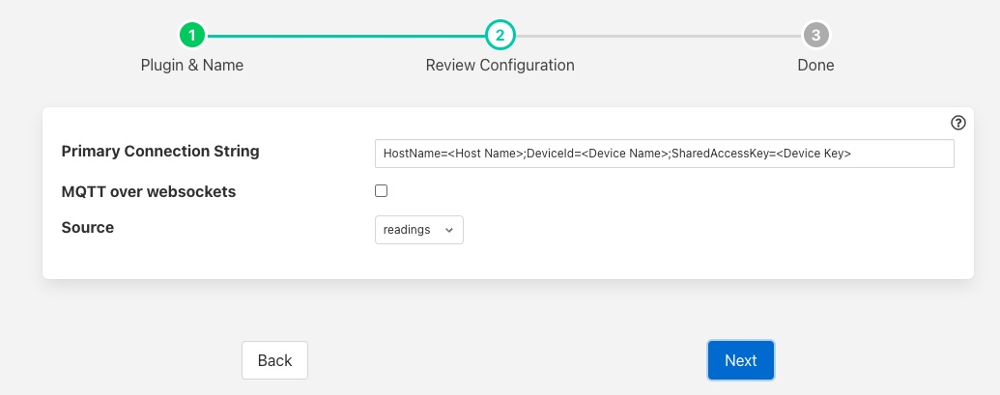

.. Images

Azure IoT Hub
=============

The *fledge-north-azure* plugin sends data from Fledge to the Microsoft Azure IoT Core service.

The configuration of the *Azure* plugin requires a few simple configuration parameters to be set.

+---------+
| |azure| |
+---------+

  - **Primary Connection String**: The primary connection string to connect to your Azure IoT project. The connection string should contain 

     - The hostname to connect to 

     - The DeviceID of the device you are using 

     - The shared access key generated on your Azure login

  - **MQTT over websockets**: Enable if you wish to run MQTT over websockets.

  - **Data Source**: Which Fledge data to send to Azure; Readings or Fledge Statistics.

  - **Apply Filter**: This allows a simple jq format filter rule to be applied to the connection. This should not be confused with Fledge filters and exists for backward compatibility reason only.

  - **Filter Rule**: A jq filter rule to apply. Since the introduction of Fledge filters in the north task this has become deprecated and should not be used.

JSON Payload
------------

The payload that is sent by this plugin to Azure is a simple JSON representation of a set of reading values. A JSON array is sent with one or more reading objects contained within it. Each reading object consists of a timestamp, an asset name and a set of data points within that asset. The data points are represented as name value pair  JSON properties within the reading property.

The fixed part of every reading contains the following

+-----------+----------------------------------------------------------------+
| Name      | Description                                                    |
+===========+================================================================+
| timestamp | The timestamp as an ASCII string in ISO 8601 extended format.  |
|           | If no time zone information is given it is assumed to indicate |
|           | the use of UTC.                                                |
+-----------+----------------------------------------------------------------+
| asset     | The name of the asset this reading represents.                 |
+-----------+----------------------------------------------------------------+
| readings  | A JSON object that contains the data points for this asset.    |
+-----------+----------------------------------------------------------------+

The content of the *readings* object is a set of JSON properties, each of which represents a data value. The type of these values may be integer, floating point, string, a JSON object or an array of floating point numbers.

A property

.. code-block:: console

    "voltage" : 239.4

would represent a numeric data value for the item *voltage* within the asset. Whereas

.. code-block:: console

    "voltageUnit" : "volts"

Is string data for that same asset. Other data may be presented as arrays

.. code-block:: console

   "acceleration" : [ 0.4, 0.8, 1.0 ]

would represent acceleration with the three components of the vector, x, y, and z. This may also be represented as an object

.. code-block:: console

   "acceleration" : { "X" : 0.4, "Y" : 0.8, "Z" : 1.0 }

both are valid formats within Fledge.

An example payload with a single reading would be as shown below

.. code-block:: console

    [
       {
           "timestamp" : "2020-07-08 16:16:07.263657+00:00",
           "asset"     : "motor1",
           "readings"  : {
                         "voltage"  : 239.4,
                         "current"  : 1003,
                         "rpm"      : 120147
                         } 
       }
   ]

